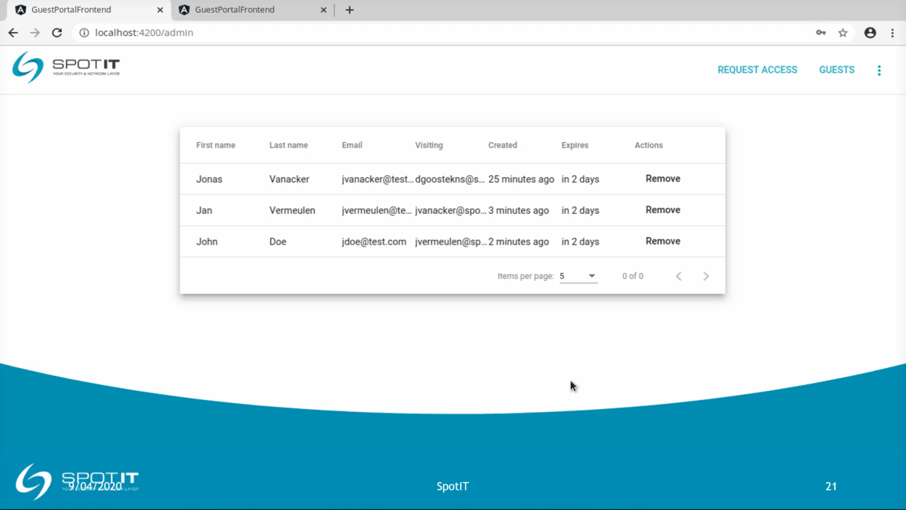
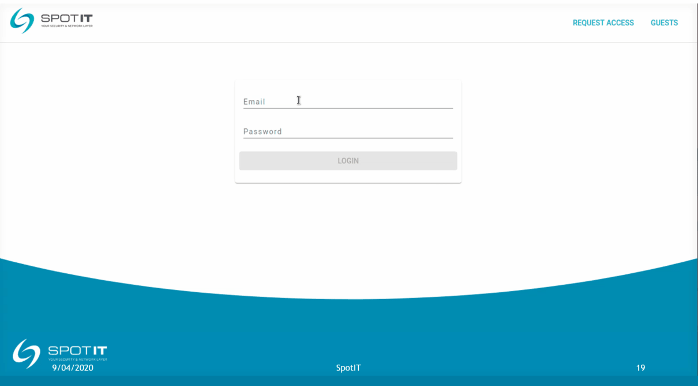

# GuestPortal-frontend

The frontend for the custom web portal built in Angular. Communicates with the backend found here. 

## Purposes

Provide both front desk employees of a company and visitors a way to easily register 'guest users' on a local guest wi-fi network. 
Front desk employees need an overview of all guest users with the possibility to deny them further guest access. 

## Implementation

A simple form integrated with the Angular Material stepper module provides a guided self registration. An optional eID reader can be used to speed up the proces. 

Employees of the company can use the provided admin route to view a realtime data table after logging in to the application. 
Security is implemented with a signed JWT token returned by the backend server after logging in successfully. To provide realtime data, the front end connects to the backend server with a secured websocket. Before establishing a full duplex connection the backend checks a provided JWT token. 

## Features

* protected routes using a JWT token and Angular route guards
* optional eID service 
* form control checking 
* lazy loading of administrator module
* realtime secured websocket connection with live data

## Demo

